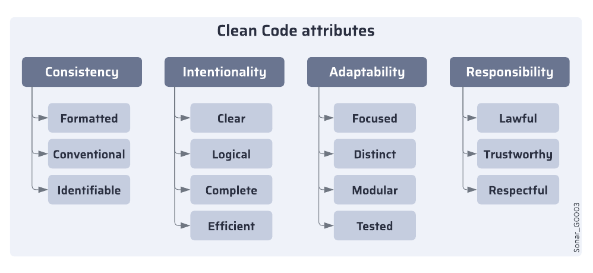
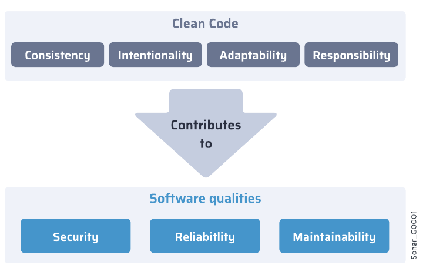
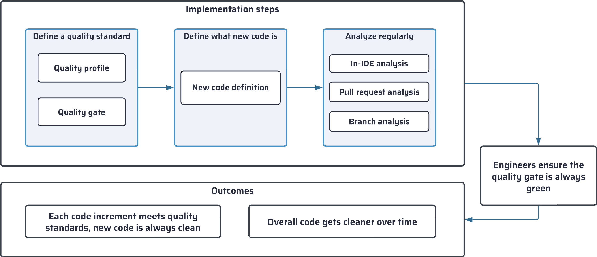

# SonarQube

>  ### ***Escribir código funcional no es suficiente.***
> - Confiable
> - Seguro
> - Mantenible

[Fuente de la documentación](https://docs.sonarsource.com/sonarqube-server/latest/ "Página oficial de SonarQube")

**SonarQube** es un sistema de análisis de código que nos ayuda a identificar problemas en más de 30 lenguajes de programación y frameworks.

Nos permite no solo **detectar errores**, sino también **mejorar continuamente** la calidad de nuestro código.

## El enfoque clean code
El código limpio es el estándar que garantiza que el software sea seguro, confiable y mantenible. Es esencial para mantener una base de código saludable.
La solución Sonar está diseñada para ayudarte a alcanzar un estado de Código Limpio

### Beneficios del código limpio: las cualidades del software

### Severidad a nivel de calidad

| **Severidad**  | **Definición**                                                                                       |
|----------------|-----------------------------------------------------------------------------------------------------|
| **Bloqueador**  | Error con una alta probabilidad de afectar el comportamiento de la aplicación en producción.        |
| **Alto**        | Error con una baja probabilidad de afectar el comportamiento de la aplicación en producción o un problema que representa una falla de seguridad. |
| **Medio**       | Un defecto de calidad que puede afectar en gran medida a la productividad del desarrollador.         |
| **Bajo**        | Un defecto de calidad que puede afectar ligeramente a la productividad del desarrollador.           |
| **Información** | Ni un error ni un defecto de calidad, solo un hallazgo.                                             |

### Análisis de código basado en código limpio

* Cada atributo de código limpio se evalúa, para un lenguaje dado, en función de una serie de reglas
    

        
Reglas: (Haz clic para expandir)

        
Cada regla:

        <ul>
            <li>Está asociada con el atributo de código limpio que evalúa.</li>
            <li>Está asociada con la(s) cualidad(es) del software a las que este atributo de Clean Code contribuye.</li>
            <li>
                Cada cualidad del software asociada (seguridad, confiabilidad o mantenibilidad) recibe un nivel de severidad 
                (crítico, alto, medio, bajo o informativo). Esta severidad determina cuánto se ve afectada esa cualidad del 
                software cuando se incumple la regla.
            </li>
        </ul>
    

* Si se incumple una regla, se genera un problema(issue).
* Este problema afecta una o más cualidades del software con diferentes * niveles de severidad.

## Clean as You Code

Práctica de desarrollo de software basada en el principio de que el código nuevo (código que ha agregado o modificado recientemente) debe cumplir con los estándares de calidad. La solución Sonar implementa Clean as You Code advirtiéndole cada vez que se detectan problemas en su nuevo código.

*Diagrama de Clean as You Code.*

    
Sobre los estándares de calidad: (Haz clic para expandir)

    
En la solución Sonar, cada uno de sus proyectos tiene un estándar de calidad establecido, compuesto por un perfil de calidad y una puerta de calidad:

    <ul>
        <li>
            <strong>Perfil de calidad:</strong> determina el conjunto de reglas que se aplican durante el análisis.
        </li>
        <li>
            <strong>Puerta de calidad:</strong> consiste en un conjunto de condiciones con las que se mide el código durante el análisis. 
            Dependiendo del resultado, el código pasará o no la puerta de calidad, lo que dará a los desarrolladores indicaciones 
            sobre si deben solucionar problemas o fusionar el código.
        </li>
    </ul>
    
<em>(Sonar way)</em>

## Métricas
[Fuente](https://docs.sonarsource.com/sonarqube-server/latest/user-guide/code-metrics/metrics-definition/)
### Mantenibilidad
#### Deuda técnica
El Deuda técnica es la suma de los costos de corrección de problemas de mantenibilidad. Un costo de corrección de problemas es el esfuerzo (en minutos) evaluado para solucionar el problema. El costo de corrección del problema se toma del esfuerzo asignado a la regla que planteó el problema.

#### Ratio de endeudamiento técnico

El ratio de deuda técnica es la relación entre el coste de desarrollar el software y la deuda técnica (el coste de arreglarlo). Se calcula sobre la base de la siguiente fórmula:

$$
\frac{\text{technicalDebt}}{\text{costToDevelop1LineOfCode} \times \text{numberOfLinesOfCode}}
$$

#### Índice
* A ≤ 5% to 0%
* B ≥ 5% to <10%
* C ≥ 10% to <20%
* D ≥ 20% to < 50%
* E ≥ 50%

### Fiabilidad
#### Índice
* A = 0 or more info issues
* B = at least one low issue
* C = at least one medium issue
* D = at least one high issue
* E = at least one blocker issue

### Seguridad
#### Índice de seguridad
* A = 0 or more info issues
* B = at least one low issue
* C = at least one medium issue
* D = at least one high issue
* E = at least one blocker issue

#### Índice de revisión de seguridad 
* A = >= 80%
* B = >= 70% and <80%
* C = >= 50% and <70%
* D = >= 30% and <50%
* E = < 30%

